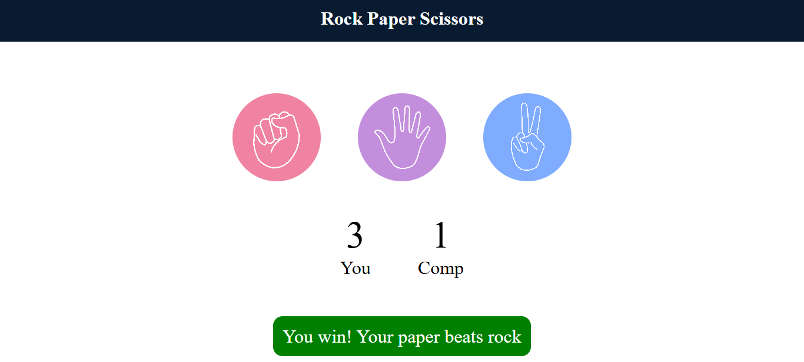

# 🎮 Rock-Paper-Scissors Game 

This is a simple *Rock-Paper-Scissors* game developed using *HTML, CSS, and JavaScript. In this game, the user plays against the computer. When the user selects either **Rock, **Paper, or **Scissors*, the computer makes a random choice. The winner is then displayed on the screen along with a congratulations or lossing message.

## 🚀 How to Run

1. *Download or Fork this Repository* to your local system.
2. Inside the folder, open the file named index.html.
3. Just *copy the code* inside index.html and *paste it into your own HTML file* (using any code editor like VS Code or even Notepad).
4. Open the file in your browser and *enjoy the game!*

✅ No extra installation or setup is required.

---

## 🧠 Features

- User chooses between Rock, Paper, or Scissors.
- Computer randomly selects its option.
- Displays result:
  - If user wins → shows *"Congratulations, User won!"*
  - If computer wins → shows *"Oops, Computer won!"*
  - If it's a tie → shows *"It's a tie!"*
- Simple and interactive UI.
- show the score as well. 

---

## 📁 Project Files Included

- index.html – Game layout
- style.css – Styling of the game
- script.js – Game logic
- screenshot.png – Preview of the game UI

> All these files have been uploaded in this repository.

---

## 🖼 Screenshot Preview

---

## 📩 Note

Feel free to fork or clone the project. If you want to test it quickly, just open index.html in your browser or paste the code into your own project.

---

🔗 *Follow me on LinkedIn* for more beginner-friendly frontend and JavaScript projects.
